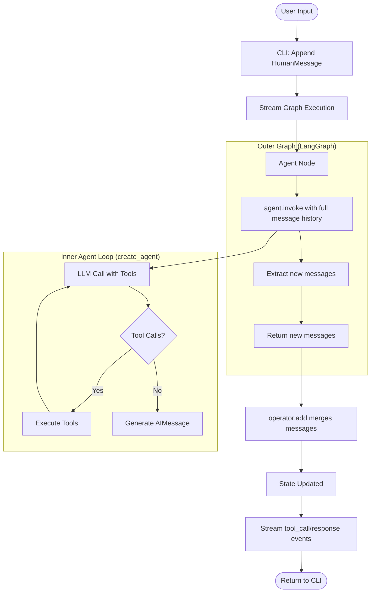

# Travel Booking Assistant

A travel booking agent CLI built with LangChain + LangGraph that helps users search for flights, hotels, answer travel questions, and manage bookings.

## Features

- **LangChain**: Uses `create_agent` API with middleware support
- **LangGraph**: Explicit control flow for agent-tool interactions
- **RAG (Retrieval Augmented Generation)**: Retrieves relevant information from travel knowledge base
- **Tools**: Flight search, hotel search, booking management, weather forecasts, knowledge base search
- **LangSmith**: Full tracing and evaluation support
- **PII Redaction**: Automatically detects and redacts email addresses and phone numbers
- **Streaming Output**: Real-time response streaming to CLI
- **Local Model Support**: Works with Ollama
- **Evals**: To test both positive and negative output

## Setup

### Quick Start

**Option 1: Using setup script**

```bash
chmod +x setup.sh
./setup.sh
source .venv/bin/activate
python3 setup_cli.py setup
python3 setup_cli.py run
```

**Option 2: Manual**

```bash
# Create virtual environment (Python 3.11+ recommended)
python3 -m venv .venv
source .venv/bin/activate

# Install dependencies
pip install --upgrade pip
pip install -r requirements.txt
```

### Ollama Setup

```bash
curl -fsSL https://ollama.ai/install.sh | sh
ollama serve
ollama pull llama3.2
```

### Environment Variables

Create a `.env` file with the following:

```env
MODEL=llama3.2
LANGCHAIN_TRACING_V2=true
LANGCHAIN_ENDPOINT=https://api.smith.langchain.com
LANGCHAIN_API_KEY=your_api_key_here
LANGCHAIN_PROJECT=travel-booking-agent
```

### Initialize and Run

```bash
# Initialize the knowledge base
python3 setup_cli.py setup

# Run the agent
python3 setup_cli.py run
```

## CLI Commands

```bash
python3 setup_cli.py setup   # Initialize knowledge base
python3 setup_cli.py run     # Run the agent
python3 setup_cli.py eval    # Run evaluation suite
python3 setup_cli.py clean   # Clean generated files
python3 setup_cli.py help    # Show help message
```

## Usage Examples

- **Flight Search**: "I need a flight from JFK to LHR on 2024-06-15"
- **Hotel Search**: "Find me a hotel in Paris for 3 nights"
- **Travel Questions**: "What are the popular destinations in Europe?"
- **Policy Questions**: "What's your cancellation policy?"
- **Booking Lookups**: "Look up booking BK12345678"
- **Weather Forecasts**: "What's the weather in Paris?"

## Evaluation

Run the evaluation suite:

```bash
python3 setup_cli.py eval
```

Or directly:

```bash
python3 -m eval.eval
```

## Architecture & Graph Design

### Graph Structure

- **Outer Graph (LangGraph)**: Explicit state management wrapper
- **Inner Graph (via create_agent)**: Agent loop orchestration handled internally

### Graph Diagram



### State Management

**Flow:**

1. CLI receives user input → Appends HumanMessage to state
2. Graph streams execution → Calls agent_node
3. Agent node:
   1. Records initial message count 
   2. Calls agent.invoke() with full message history 
   3. Agent internally loops: LLM → tool calls → tool results → LLM → ... → final response 
   4. Extracts only NEW messages (after initial_count)
   5. Returns {"messages": new_messages}
4. State update: operator.add automatically appends new messages to state
5. Streaming: CLI iterates through events, displaying tool calls and responses
6. Final state sync: Graph reinvokes to get complete final state


### Decision Points

- LLM decides which tools to call based on query intent and context
- If tool calls exist → execute tools → return results to model
- If no tool calls → generate final response
- State persists across turns, avoiding duplication

### Design Notes

- Two-level graph allows explicit state tracking and future extensions
- Streams events for real-time feedback
- Tools are stateless; RAG tool uses vector store
- PIIMiddleware automatically redacts sensitive data

## Potential Improvements

1. **Error Handling & Recovery**: Retry logic, more error handling
2. **Production Readiness**: Dockerization, API server, auth, rate limiting, logging
3. **Enhanced Graph Structure**: Intent classification and specialized routing
4. **Checkpointing & Persistence**: Resume conversations, multi-session state
5. **Advanced RAG**: Multi-query retrieval, hybrid search

